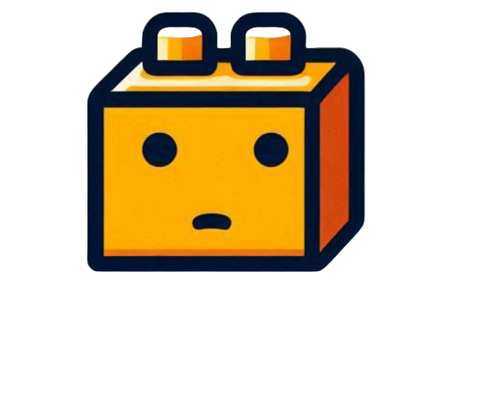

# Code Connect

<div align="center">



**A visual programming tool for learning coding fundamentals through interactive flowcharts**

[](https://reactjs.org/)
[](https://reactflow.dev/)
[](https://firebase.google.com/)

</div>

---

## About

**Code Connect** is an intuitive visual programming tool designed to help beginners—especially young children—learn the basics of coding. By connecting Lego-like software components on an interactive flowchart canvas, users can build programs without writing traditional code syntax.

With real-time code generation, step-by-step execution, and visual feedback, Code Connect transforms abstract programming concepts into tangible, hands-on learning experiences.

## ✨ Key Features

### 🎨 Visual Flowchart Editor
- Drag-and-drop blocks onto an intuitive canvas
- Block types: Start, End, If/Then, While Loops, Output, Variables, and Character Movement
- Seamless edge connections between blocks

### ⚡ Real-Time Code Generation
- Automatically generates clean JavaScript code from your flowchart
- Live code preview with syntax highlighting
- One-click copy functionality

### ▶️ Interactive Execution
- Execute programs step-by-step with customizable delays
- Visual highlighting of active blocks during runtime
- Animated edges showing program flow

### 💾 Project Persistence
- Local storage saves your work automatically
- Cloud sync with Firebase authentication
- Export/Import projects as JSON files

### 👤 User Accounts
- Email/password registration
- Google Sign-In integration
- Manage all your projects from one dashboard

### 📚 Built-In Examples
- Hello World
- Conditional Logic (If/Then)
- Loops (While)
- Jumpstart your learning with pre-built templates

### 🎨 Customizable Interface
- Toggleable right panel for character, console, and code views
- Light/Dark mode support
- Responsive design for various screen sizes

## 🚀 Getting Started

### Prerequisites

- **Node.js** (v18 or later recommended)
- **npm** or **yarn**
- A Firebase project (for authentication and cloud storage features)

### Installation

1. **Clone the repository**
   ```bash
   git clone https://github.com/yourusername/code-connect.git
   cd code-connect
   ```

2. **Install dependencies**
   ```bash
   npm install
   ```

3. **Set up Firebase**
   - Create a project at [Firebase Console](https://console.firebase.google.com/)
   - Enable **Authentication** (Email/Password & Google)
   - Enable **Firestore Database**
   - Copy your Firebase config to `src/config/firebase.js`:
     ```javascript
     import { initializeApp } from "firebase/app";
     import { getAuth } from "firebase/auth";
     import { getFirestore } from "firebase/firestore";

     const firebaseConfig = {
       apiKey: "YOUR_API_KEY",
       authDomain: "YOUR_PROJECT_ID.firebaseapp.com",
       projectId: "YOUR_PROJECT_ID",
       storageBucket: "YOUR_PROJECT_ID.appspot.com",
       messagingSenderId: "YOUR_SENDER_ID",
       appId: "YOUR_APP_ID"
     };

     const app = initializeApp(firebaseConfig);
     export const auth = getAuth(app);
     export const db = getFirestore(app);
     ```

4. **Start the development server**
   ```bash
   npm start
   ```

   The app will open at [http://localhost:3000](http://localhost:3000)

## 🛠️ Tech Stack

| Technology | Purpose |
|------------|---------|
| **React 18** | UI Framework |
| **React Flow** | Flowchart/Block Editor |
| **Firebase** | Auth & Database |
| **CSS Modules** | Styling |

## 📖 Usage Guide

### Creating Your First Program

1. **Start Block** - Every program begins with a Start block
2. **Add Blocks** - Drag blocks from the palette onto the canvas
3. **Connect Blocks** - Click the handle on one block and drag to another
4. **Generate Code** - Click "Generate" to see the JavaScript output
5. **Run** - Execute your program and watch it come to life!

### Available Blocks

| Category | Blocks |
|----------|--------|
| **Control Flow** | Start, End |
| **Logic** | If/Then, While Loop |
| **Variables** | Create Variable, Update Variable |
| **I/O** | Input, Output |
| **Character** | Move, Rotate |

## 🤝 Contributing

Contributions are welcome! Please feel free to submit a Pull Request.

1. Fork the repository
2. Create your feature branch (`git checkout -b feature/AmazingFeature`)
3. Commit your changes (`git commit -m 'Add some AmazingFeature'`)
4. Push to the branch (`git push origin feature/AmazingFeature`)
5. Open a Pull Request

## 📝 License

This project is licensed under the MIT License - see the [LICENSE](LICENSE) file for details.

## 🙏 Acknowledgments

### Libraries & Tools
- [React Flow](https://reactflow.dev/) for the amazing flowchart library
- [Create React App](https://github.com/facebook/create-react-app) for the project bootstrap
- [Firebase](https://firebase.google.com/) for backend services
- [React.js](https://reactjs.org/) for the UI framework
- [Google Fonts](https://fonts.google.com/) for typography

### Inspiration & Learning Resources
- [Blockly](https://developers.google.com/blockly) by Google - for inspiring visual programming concepts
- [MIT Scratch](https://scratch.mit.edu/) - for pioneering accessible coding education
- [CS50](https://cs50.harvard.edu/) - for educational programming concepts

### Open Source Icons
- [Font Awesome](https://fontawesome.com/) for the icon set
- [Flaticon](https://www.flaticon.com/) for custom illustrations

### testers & Early Users
- Beta testers who provided invaluable feedback during development
- Educators who inspired the design with real classroom needs
